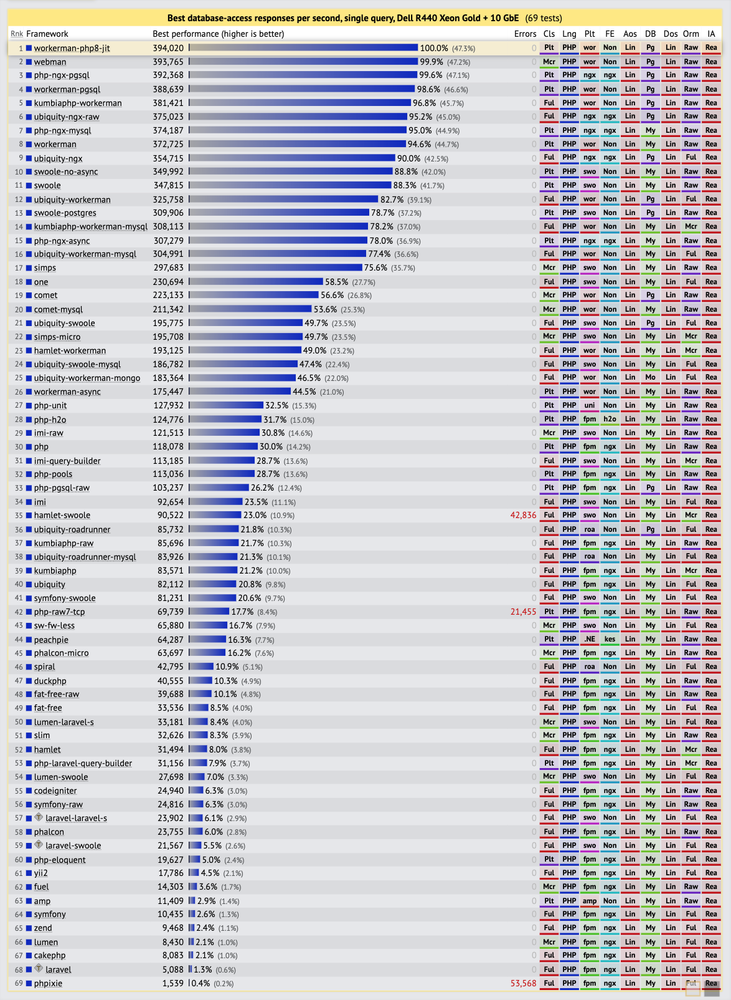

# Workerman prend-il en charge la concurrence?

**Le concept de** concurrence **est trop vague, nous allons l'expliquer ici avec deux mesures quantifiables: le nombre de connexions concurrentes et le nombre de requêtes concurrentes.**

**Le nombre de connexions concurrentes** fait référence au nombre total de connexions TCP maintenues par le serveur à un moment donné, sans se soucier de savoir si ces connexions sont utilisées pour la communication de données. Par exemple, un serveur de messagerie peut maintenir des millions de connexions d'appareils, mais s'il y a peu de communication de données sur ces connexions, la charge sur ce serveur pourrait être presque nulle, tant que la mémoire est suffisante, il peut continuer à accepter des connexions.

**Le nombre de requêtes concurrentes** est généralement mesuré en QPS (le nombre de requêtes traitées par le serveur chaque seconde), sans se soucier du nombre actuel de connexions TCP sur le serveur à un moment donné. Par exemple, un serveur n'a que 10 connexions clients, mais chaque client envoie 10 000 requêtes par seconde, donc le serveur doit pouvoir supporter au moins 10 * 10 000 = 100 000 requêtes par seconde (QPS). En supposant que 100 000 requêtes par seconde représentent la limite de ce serveur, s'il reçoit une requête par seconde de chaque client, le serveur peut supporter 100 000 clients.

**Le nombre de connexions concurrentes** est limité par la mémoire du serveur. En général, un serveur Workerman avec 24 Go de mémoire peut prendre en charge environ **1,2 million** de connexions concurrentes.

**Le nombre de requêtes concurrentes** est limité par la capacité de traitement du CPU du serveur. Un serveur Workerman à 24 cœurs peut atteindre un débit de **450 000** requêtes par seconde (QPS), la valeur réelle varie en fonction de la complexité de l'activité et de la qualité du code.

## Remarque

Dans les scénarios à haute concurrence, l'extension event doit être installée, veuillez vous référer au chapitre d'installation et de configuration. De plus, l'optimisation du noyau Linux est nécessaire, en particulier la limite du nombre de fichiers ouverts par processus, veuillez-vous référer au chapitre d'optimisation du noyau dans l'annexe.

## Données de test de performance
> Les données sont issues du 20ème tour de test de performance par un organisme de test tiers de renom, techempower.com
https://www.techempower.com/benchmarks/#section=data-r20&hw=ph&test=db&l=zik073-sf

**Configuration du serveur :**
Total des cœurs 14, total des threads 28, 32 Go de mémoire, commutateur Ethernet Cisco dédié à 10 gigabits
**Logique métier :**
Activité avec requêtes de base de données, base de données pgsql, php8+jit
QPS supérieur à 390 000

