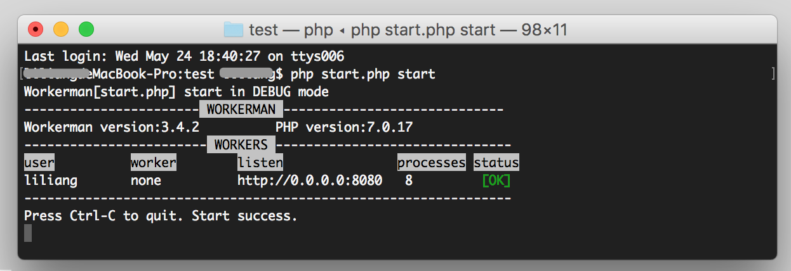

# Những vấn đề mà mọi người phát triển Workerman cần biết

**1. Giới hạn môi trường windows**
- Trong hệ điều hành windows, mỗi tiến trình Workerman chỉ hỗ trợ 200+ kết nối.
- Trong hệ điều hành windows, không thể sử dụng tham số count để cài đặt nhiều tiến trình.
- Trong hệ điều hành windows, không thể sử dụng các lệnh như status, stop, reload, restart.
- Trong hệ điều hành windows, không thể chạy đa tiến trình đẻ phục vụ, khi cửa sổ cmd đóng điều đó sẽ khiến dịch vụ dừng.
- Trong hệ điều hành windows, không thể khởi tạo nhiều lắng nghe từ một tệp.
- Trong hệ điều hành linux không có những giới hạn đó, nên khuyến nghị sử dụng hệ điều hành linux cho môi trường sản xuất, nhưng có thể sử dụng windows cho môi trường phát triển.

**2. Workerman không phụ thuộc vào apache hoặc nginx**
Workerman chính là một bộ container tương tự như apache/nginx, chỉ cần [PHP môi trường OK](315116) Workerman có thể hoạt động.

**3. Workerman được khởi động qua dòng lệnh**
Cách khởi động tương tự như apache sử dụng lệnh (thông thường không thể sử dụng Workerman trên hosting web). Giao diện khởi động như sau:


**4. Kết nối kéo dài phải có heartbeat**
Kết nối kéo dài phải có heartbeat, kết nối kéo dài phải có heartbeat, kết nối kéo dài phải có heartbeat, thông điệp quan trọng được nhắc lại ba lần.
Khi kết nối kéo dài không giao tiếp trong một khoảng thời gian dài sẽ bị các nút định tuyến xóa khỏi mạng dẫn đến đóng kết nối.
[Thông tin heartbeat của Workerman](faq/heartbeat.md), [Thông tin heartbeat của gatewayWorker](https://www.workerman.net/doc/gateway-worker/heartbeat.html)

**5. Giao thức của máy chủ và máy khách phải tương ứng để liên lạc**
Đây là vấn đề rất phổ biến mà các nhà phát triển gặp phải. Ví dụ nếu máy khách sử dụng giao thức websocket, máy chủ phải cũng sử dụng giao thức websocket (máy chủ```new Worker('websocket://0.0.0.0...')```) mới có thể kết nối và giao tiếp được. 
Không thử truy cập cổng giao thức websocket thông qua thanh địa chỉ trình duyệt, không thử truy cập cổng giao thức websocket bằng cách sử dụng giao thức tcp trần bị, các giao thức phải tương ứng với nhau.

Nguyên tắc ở đây tương tự như việc nếu bạn muốn giao tiếp với người Anh, bạn phải sử dụng tiếng Anh. Nếu muốn giao tiếp với người Nhật, bạn phải sử dụng tiếng Nhật. Tương tự, nguyên tắc này cũng áp dụng cho giao thức liên lạc, cả hai bên (máy khách và máy chủ) phải sử dụng cùng một ngôn ngữ mới có thể giao tiếp, nếu không sẽ không thể liên lạc.

**6. Lý do có thể gây sự cố kết nối**
Một vấn đề rất phổ biến khi mới sử dụng Workerman là kết nối từ máy khách tới máy chủ bị lỗi. Lý do thường gặp như sau:
1. Tường lửa máy chủ (bao gồm cả nhóm an ninh máy chủ đám mây) chặn kết nối (khoảng 50%)
2. Máy khách và máy chủ sử dụng giao thức không tương thích (khoảng 30%)
3. Sai IP hoặc cổng (khoảng 15%)
4. Máy chủ chưa hoạt động 

**7. Không nên sử dụng exit, die, sleep trong mã lệnh kinh doanh**
Sử dụng exit hay die trong mã lệnh kinh doanh sẽ khiến tiến trình kết thúc và hiển thị lỗi WORKER EXIT UNEXPECTED. Tất nhiên, khi tiến trình kết thúc sẽ khởi động ngay lập tức một tiến trình mới. Nếu cần trả về, có thể gọi lệnh return. Lệnh sleep sẽ khiến tiến trình ngủ, trong quá trình ngủ sẽ không thực hiện gì cả và nền tảng cũng sẽ dừng hoạt động, dẫn đến tất cả các yêu cầu từ khách hàng trong tiến trình đó không thể được xử lý.

**8. Không nên sử dụng hàm pcntl_fork**
`pcntl_fork` được sử dụng để tạo ra các tiến trình mới theo cách động, nếu sử dụng `pcntl_fork` trong mã lệnh kinh doanh, nó có thể tạo ra các tiến trình mồ côi không thể thu hồi, dẫn đến sự cố trong kinh doanh. Sử dụng `pcntl_fork` trong kinh doanh cũng sẽ ảnh hưởng đến xử lý sự kiện kết nối, thông điệp, đóng kết nối, bộ định thời và các sự kiện khác, dẫn đến các sự cố không thể dự đoán.

**9. Không nên có vòng lặp vô hạn trong mã lệnh kinh doanh**
Mã lệnh kinh doanh không nên có vòng lặp vô hạn, nếu không điều đó sẽ khiến quyền kiểm soát không thể trả về cho nền tảng Workerman, dẫn đến không thể nhận hoặc xử lý tin nhắn từ các khách hàng khác.

**10. Cần khởi động lại để thấy sự thay đổi trong mã lệnh**
Workerman là một nền tảng mã lệnh luôn có mặt trong bộ nhớ, cần khởi động lại Workerman để thấy được hiệu quả của mã lệnh mới.

**11. Ứng dụng kết nối kéo dài nên sử dụng nền tảng GatewayWorker**
Rất nhiều nhà phát triển sử dụng Workerman để phát triển các ứng dụng **kết nối kéo dài**, ví dụ như trò chuyện trực tuyến, internet vạn vật và còn nhiều nữa, **ứng dụng kết nối kéo dài nên sử dụng trực tiếp nền tảng GatewayWorker**, nó được thiết kế lại dựa trên Workerman, làm cho việc phát triển ứng dụng kết nối kéo dài trở nên đơn giản và dễ dàng hơn.

**12. Hỗ trợ số lượng kết nối cao hơn**
Nếu số lượng kết nối kinh doanh đồng thời vượt quá 1000, hãy nhớ [tối ưu hóa hạt nhân của linux](appendices/kernel-optimization.md) và [cài đặt tiện ích event](appendices/install-extension.md).
