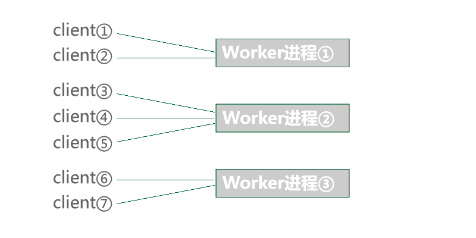

# 原理

### Worker 說明
Worker 是 WorkerMan 中最基本的容器，它可以開啟多個進程監聽端口並使用特定協議通訊，類似 nginx 監聽某個端口。每個 Worker 進程獨立運作，採用 Epoll（需要安裝 event 擴展）+ 非阻塞IO，每個 Worker 進程都能處理上萬個客戶端連接並處理這些連接上發來的數據。主進程為了保持穩定性，只負責監控子進程，不負責接收數據也不做任何業務邏輯。

### 客戶端與 worker 進程的關係

### 主進程與 worker 子進程關係

**特點：**

從圖上我們可以看出每個 Worker 維持著各自的客戶端連接，能夠方便地實現客戶端與服務端的實時通訊，基於這種模型我們可以方便實現一些基本的開發需求，例如 HTTP 伺服器、Rpc 伺服器、一些智能硬體實時上報數據、服務端推送數據、遊戲伺服器、微信小程序後台等等。
