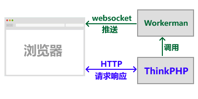

# 如何與其他框架整合
**問：**

如何與其他mvc框架（thinkPHP、Yii等）整合？

**答：**

建議將Workerman與其他mvc框架結合，以圖中所示的方式（以ThinkPHP為例）：

1、ThinkPHP和Workerman是兩個獨立的系統，可以獨立部署（可以在不同的伺服器上部署），彼此不干擾。

2、ThinkPHP使用HTTP協議在瀏覽器中呈現網頁頁面。

3、由ThinkPHP提供的頁面的JavaScript發起WebSocket連接，連接到Workerman。

4、一旦連接成功，向Workerman發送一個包含使用者名稱、密碼或某種令牌的數據包，用於驗證WebSocket連接是屬於哪個使用者。

5、僅在ThinkPHP需要向瀏覽器推送數據時，才調用Workerman的Socket接口來發送數據。

6、其餘的請求仍然使用原來的ThinkPHP HTTP方式處理。

**總結：**

將Workerman作為一個可以向瀏覽器推送數據的通道，僅當需要向瀏覽器推送數據時才調用Workerman接口來完成推送。所有業務邏輯都在ThinkPHP中完成。

有關於如何使用ThinkPHP調用Workerman的Socket接口來推送數據的相關信息，請參考[常見問題-在其他項目中推送](push-in-other-project.md)一節。

**ThinkPHP官方已經支持Workerman，請參見[ThinkPHP5手冊](https://www.kancloud.cn/manual/thinkphp5/235128)**
